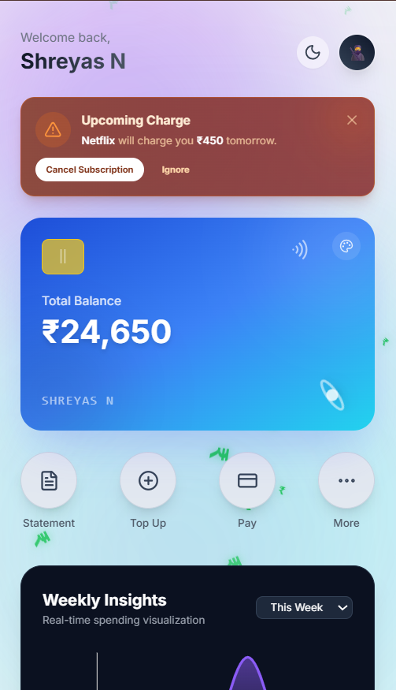
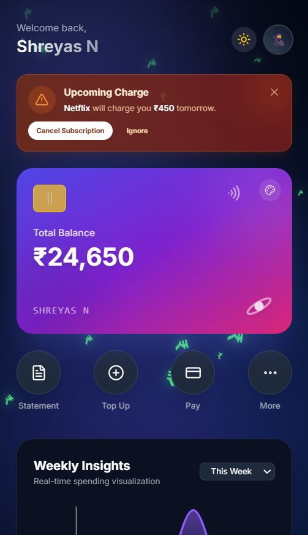
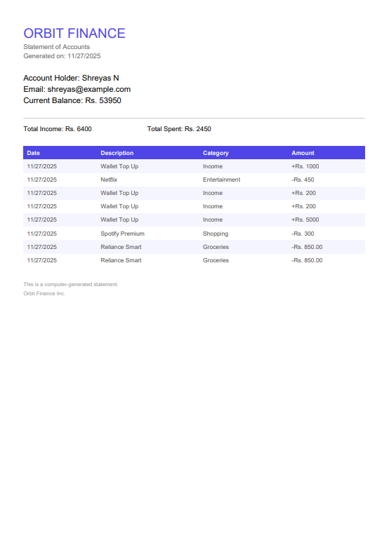

# 🪐 Orbit Finance

**The Next-Generation Personal Finance Dashboard.**
*Built for the OVERCLOCK vibe-coding hackathon - Problem Statement 1: Automated Budgeting & Insights.*

Orbit is a mobile-first, gamified fintech application designed to make personal finance engaging, secure, and insightful. It combines real-time data tracking with AI-driven insights and sensory feedback.

---

## 🚀 Key Features

### 🧠 Smart Insights & AI
- **Orbit Financial Coach:** A rule-based AI assistant that analyzes spending patterns and offers polite, actionable advice (e.g., "You spent ₹5k on Shopping, maybe wait 24h next time?").
- **Subscription Monitor:** Automatically detects recurring payments and alerts users before they are charged.
- **Visual Analytics:** Real-time spending graphs powered by Recharts.

### 🎮 Gamification & Engagement
- **Financial Mastery Badges:** Unlock achievements (e.g., "Saver Sage", "Visionary") based on real usage data.
- **Savings Vaults:** Create specific goals (e.g., "Audi Car"), visualize progress bars, and deposit funds instantly.
- **Sensory UX:** Haptic feedback (vibrations) and custom sound effects for transactions and interactions.

### 💳 Banking Utilities
- **Card Controls:** Freeze/Unfreeze your digital card instantly to block payments.
- **Statement Export:** Generate professional PDF bank statements on the fly using `jsPDF`.
- **Wallet Top-Up:** Simulate adding funds to your digital wallet.
- **Manual Entry:** Rapidly log expenses with category selection and subscription toggles.

### 🎨 UI/UX Excellence
- **Dual Theme Engine:** Fully supported **Dark Mode (Cyberpunk)** and **Light Mode (Clean)**.
- **Dynamic Backgrounds:** "Aurora Flow" animations mixed with floating Neon Rupee particles.
- **Customizable Interface:** Change card gradients and select from 10+ 3D Memoji avatars.
- **Native Feel:** Designed as a PWA-ready mobile web app.

---

## 🛠️ Tech Stack

- **Framework:** [Next.js 14](https://nextjs.org/) (App Router)
- **Styling:** [Tailwind CSS](https://tailwindcss.com/)
- **Animations:** [Framer Motion](https://www.framer.com/motion/)
- **Backend & Auth:** [Firebase](https://firebase.google.com/) (Firestore & Authentication)
- **Icons:** [Lucide React](https://lucide.dev/)
- **PDF Generation:** `jspdf` & `jspdf-autotable`
- **Charts:** `recharts`

---

## 📸 Screenshots

| Dashboard (Light) | Dark Mode |
| :---: | :---: |
|  |  |

**PDF Statement Export:**


---

## ⚡️ Getting Started

### 1. Clone the repository
```bash
git clone [https://github.com/your-username/orbit-finance.git](https://github.com/your-username/orbit-finance.git)
cd orbit-finance